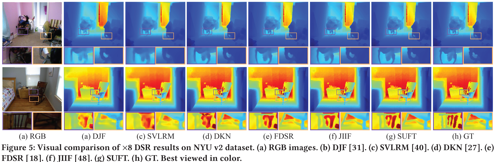

# SUFT

ACM MM 2022: Symmetric Uncertainty-Aware Feature Transmission for Depth Super-Resolution. [arXiv](https://arxiv.org/abs/2306.00386)

## Abstract

Color-guided depth super-resolution (DSR) is an encouraging paradigm that enhances a low-resolution (LR) depth map guided by an extra high-resolution (HR) RGB image from the same scene. Existing methods usually use interpolation to upscale the depth maps before feeding them into the network and transfer the high-frequency information extracted from HR RGB images to guide the reconstruction of depth maps. However, the extracted high-frequency information usually contains textures that are not present in depth maps in the existence of the cross-modality gap, and the noises would be further aggravated by interpolation due to the resolution gap between the RGB and depth images. To tackle these challenges, we propose a novel Symmetric Uncertainty-aware Feature Transmission (SUFT) for color-guided DSR. (1) For the resolution gap, SUFT builds an iterative up-and-down sampling pipeline, which makes depth features and RGB features spatially consistent while suppressing noise amplification and blurring by replacing common interpolated pre-upsampling. (2) For the cross-modality gap, we propose a novel Symmetric Uncertainty scheme to remove parts of RGB information harmful to the recovery of HR depth maps. Extensive experiments on benchmark datasets and challenging real-world settings suggest that our method achieves superior performance compared to state-of-the-art methods.


## Usage

* Training on NYU_v2 dataset:

```
$ python train.py --device 0 --batch_size 1 --root_dir [your dataset path]/NYU_v2 --scale 4
```
Arguments you can freely tweak given a dataset:

* device: which gpu used
* root_dir: path of datasets (replace [your dataset path] with your own dataset root)
* scale: scale factor of the experiment

## Experiments
| SUFT | x4 | x8 | x16 |
|---|---|---|---|
| NYU_v2 | 1.12 | 2.51| 4.86 |
| Middlebury | 1.07 | 1.75 | 3.18 |
| RGB-D-D | 1.10 | 1.69 | 2.71 |

Visualization on NYU_v2 dataset:


## Citation
If you use this code for your research, please consider citing:

```
@inproceedings{shi2022symmetric,
  title={Symmetric Uncertainty-Aware Feature Transmission for Depth Super-Resolution},
  author={Shi, Wuxuan and Ye, Mang and Du, Bo},
  booktitle={Proceedings of the 30th ACM International Conference on Multimedia},
  pages={3867--3876},
  year={2022}
}
```

## Acknowledgement

This work is supported by National Natural Science Foundation of China (62176188), Key Research and Development Program of Hubei Province (2021BAA187), Special Fund of Hubei Luojia Laboratory (220100015).

**We thank the following repos providing helpful components/functions in our work.**
* [RGB-D-D (FDSR)](https://github.com/lingzhi96/RGB-D-D-Dataset)
